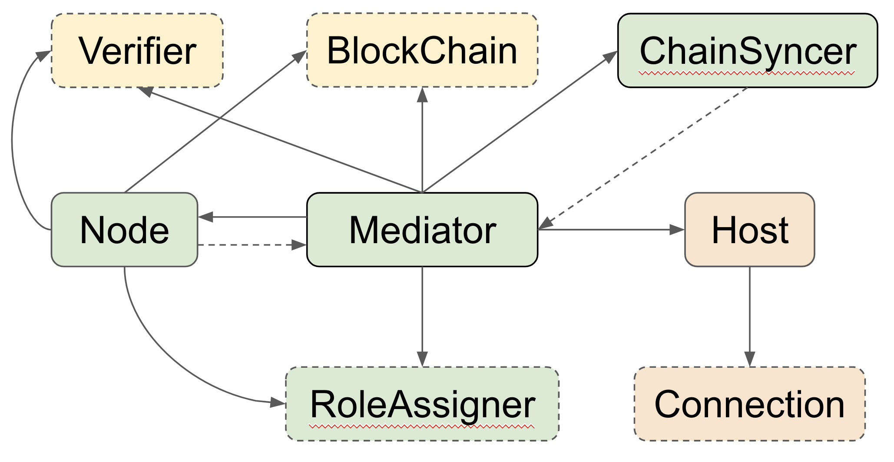

## Author's Note
This project is forked from [Pala](https://github.com/thundercore/pala). Pala
inspires a few other projects and we try to improve the code structure and make
it easy to be reused or imported by other projects.

We basically don't change any thing substantial to the original project. The
major change is to move all source files from `src/thunder2/` to the home
directory, as well as format improvement of some documents.

## Overview

[PaLa](https://eprint.iacr.org/2018/981) is a byzantine fault tolerant consensus
 protocol invented by T-H. Hubert Chan, Rafael Pass, and Elaine Shi. It can
 achieve low latency and high throughput in a partially synchronous network
 setting. PaLa allows support seamless proposer switch with no delay in normal
 operation. When there is a network partition, the protocol switches proposers
 with little delay (say 6s) to keep liveness as long as there are at least one
 honest proposer and 2/3 voters in a single partition. All honest nodes maintain
 consistency no matter how the network is partitioned.

Thunder Token Inc, the company building the ThunderCore blockchain, [plans to
use PaLa to move towards a more decentralized architecture](https://medium.com/thundercore/committee-election-in-thundercore-pos-scheme-2d7163555997).
This repository is a proof of concept of PaLa.

Here is a summary of its status:
* The **consensus** protocol is done with many test cases.
* The **network** package fulfills the minimum requirements of the protocol and
  is designed to be replaced in a production implementation.
* The **blockchain** package defines the interfaces used by the consensus layer
  and provides a detailed fake implementation. This is intended to be replaced
  with a real blockchain implementation e.g. `geth`.
* There are many items marked with "TODO(thunder)" which are suggestions for
  making a production implementation.

## Building

The code has been tested on tested it on Fedora 29 and MacOS with go1.13.4
1. Set up `$GOPATH` properly on your computer. Make sure there is a path of
   `$GOPATH\src`
1. Clone the repo to `$GOPATH\src`
   ```
   $ git clone git@github.com:ArrowZzz/pala.git
   ```
1. Under home directory run the following commands
   ```
   $ make dep 
   $ make test
   ```

## Distributed Consensus in Practice
To fill the gap between the academic paper and a working product, our developers
discussed the details of [PaLa](https://eprint.iacr.org/2018/981) with Prof.
Elaine Shi and came up with the [pseudocode](https://github.com/ArrowZzz/pala/blob/master/documents/doubly-pipelined-pala-pseudo-code.md). The pseudo code is the
reference for this project and is a good starting point for understanding this
beautiful consensus protocol.

## Software Architecture

Although PaLa is already a consensus protocol very suitable for implementation,
a distributed system is inherently complicated. We take testing seriously and
would like to test network partitioning and byzantine behavior as much as
possible. With test-driven development in mind, we came up with the relationship
diagram below:



We can replace objects with dashed lines by fake implementations to simulate our
interesting control flows. For example, using fake connection objects, we can
simulate network delays and partitions easily. Click [here](https://docs.google.com/presentation/d/1AY-GiujqkzRdfdleDSrj516d48-3w-z70w4DQiy_3HY/edit?usp=sharing)
to see the full design document.

## Supporting Documents

* [Doubly Pipelined PaLa pseudocode](https://github.com/ArrowZzz/pala/blob/master/documents/doubly-pipelined-pala-pseudo-code.md): understand how the consensus protocol
  is implemented in practice.
* [Terminology and data flow](https://docs.google.com/presentation/d/1vQ1Kh5O_kNXe0y0GK9c26UTmblPIdx8DDoKmPhrrr3c/edit?usp=sharing): understand how
  PaLa works via examples of different scenarios.
* [Software architecture](https://docs.google.com/presentation/d/1AY-GiujqkzRdfdleDSrj516d48-3w-z70w4DQiy_3HY/edit?usp=sharing): understand the
  architecture and how objects interact.
* [Goroutines and Channels](https://docs.google.com/presentation/d/1gWASAqIgjMtjYy5O31bIRwg3VViDpc9GIRPiwiA7BHo/edit?usp=sharing): understand the
  concurrency design.
* [Slides for PaLa talk](https://docs.google.com/presentation/d/1O_FEApTCfWywIZ2fMl18xE51AkJgx5LWY_NGdtbhUIk/edit): Slides for a talk on PaLa
  and PaLa software architecture given by Chia-Hao Lo @ COSCUP 2019. A recording
  of the talk itself given in Mandarin is available
  [here](https://www.youtube.com/watch?v=HbDmtB0FGcs&feature=youtu.be).

## Contributing

Feel free to fork and make PRs. Since this is the proof-of-concept, we are glad
to see feedback from the community and make the implementation and tests more
complete.

## FAQ

### Will Thunder Token continue to update this repository?
Yes, however, developers in Thunder Token are working on many features and we
may not update frequently.

### Why are there many fake objects?
As we explained in the Software Architecture document, we take testing
seriously. The fake objects are used to assist tests and let us focus on the
consensus protocol only. The core of the consensus protocol is a real
implementation. However, to make a blockchain using PaLa, you need to replace
those fake objects by real, production implementations.

### Are there examples of how PaLa overcomes the difficult issues in distributed consensus?

[TestLivenessAndDisasterRecovery](https://github.com/ArrowZzz/pala/blob/master/consensus_test/consensus_test.go#L92) is an example of recovering from data loss, and [TestVoterReconfiguration](https://github.com/ArrowZzz/pala/blob/master/consensus_test/consensus_test.go#L408) is another example of switching proposers when there are network hiccups.

### What's the suggested value for K (outstanding unnotarized proposals) in PaLa?
K affects finality latency and throughput. When K is high, the finality latency
is longer, but we have more reliable throughput; when K is low, the result is
the opposite. You can get an idea of the trade-offs from the single-process
benchmark results below:

| K                 | 1  | 5     | 10    |
|-------------------|----|-------|-------|
| Block per second | 45 | 216.5 | 406.5 |

* Packet delay: 10ms
* Number of voters: 33
* Test rounds: 5

## License
[MIT](https://github.com/ArrowZzz/pala/blob/master/LICENSE)
